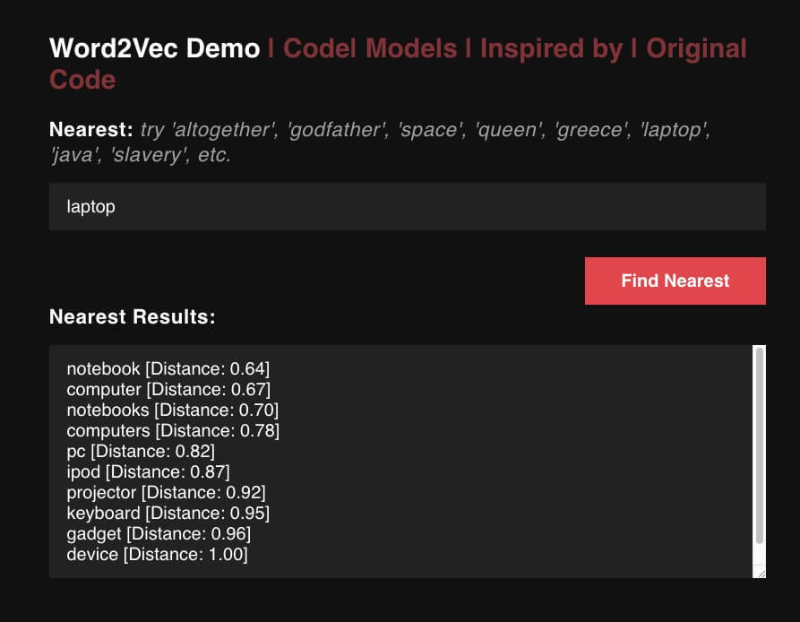

## Word2Vec with TensorFlow.JS

## [Demo](https://kostasx.github.io/Word2Vec-in-JavaScript/)

---

## REFERENCES

### [What are Word Embeddings](https://www.wikiwand.com/en/Word_embedding)

### [What is Word2Vec?](https://towardsdatascience.com/using-word2vec-for-music-recommendations-bb9649ac2484#3cfe)

---

### Todo

- Implement function `getAntonym()`. References:
    - [How to obtain antonyms through Word2Vec](https://stackoverflow.com/questions/31814825/how-to-obtain-antonyms-through-word2vec)
    - [Exploring Antonyms](https://gist.github.com/kostasx/cb40e695588370faafd70b78b6c1f773)
- Implement function [`doesnt_match` from Python](/doesnt_match.py): Which word from the given list doesn't go with the others?
